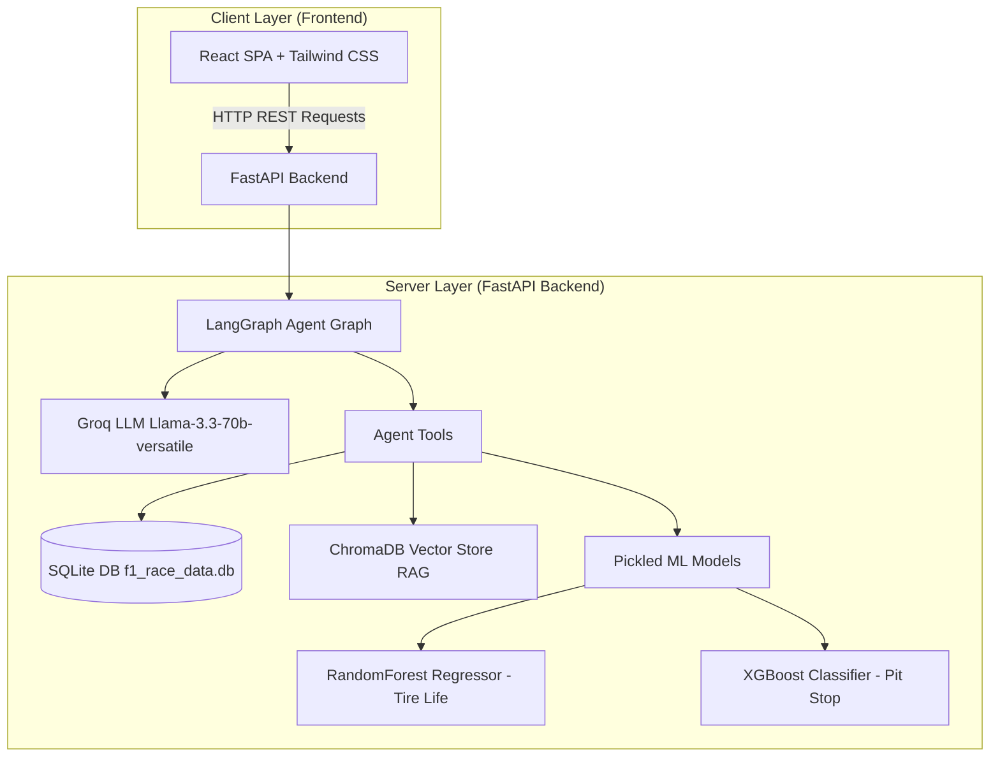
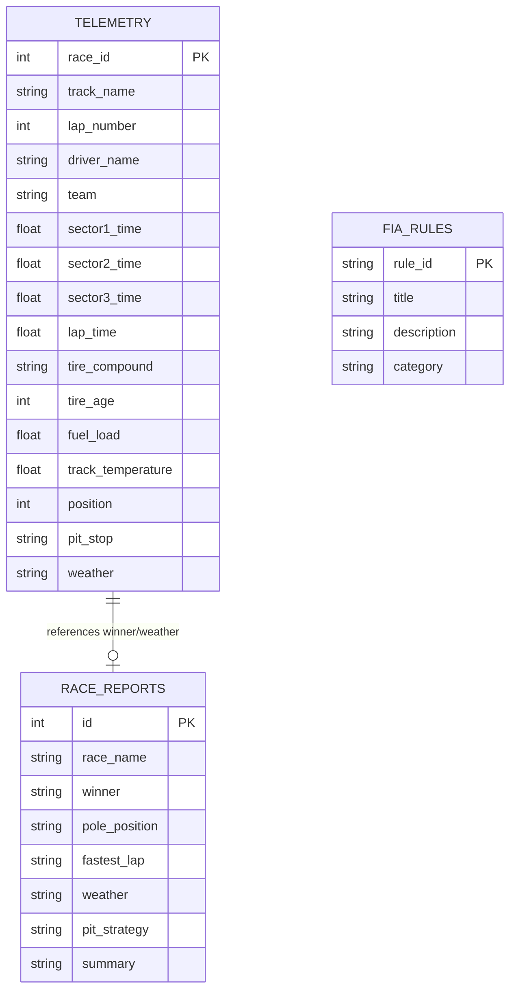
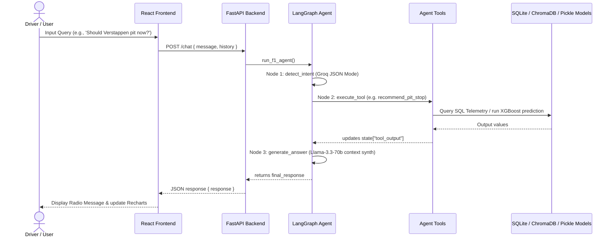

# F1 AI Race Engineer - Generative AI Application

A production-ready Generative AI and Machine Learning application that simulates a Formula 1 Race Engineer. The system performs telemetry calculations, predicts tire degradation, classifies pit stop windows, retrieves FIA rules and race reports via RAG (Retrieval Augmented Generation), and utilizes a stateful LangGraph Agent linked to Groq LLM.

This project is built for the **MCA Generative AI Specialization Final-Year Project**.

---

## Systems Architecture Diagram



---

## Entity-Relationship (ER) Diagram



---

## Data Flow Diagram



---

## Project Structure

```text
F1/
├── docker-compose.yml
├── README.md
├── viva_questions.md
├── backend/
│   ├── Dockerfile
│   ├── requirements.txt
│   ├── generate_data.py
│   ├── train_ml.py
│   ├── main.py
│   ├── data/
│   │   ├── race_telemetry.csv
│   │   ├── tire_degradation.csv
│   │   ├── fia_rules.json
│   │   ├── race_reports.json
│   │   └── f1_race_data.db
│   ├── models/
│   │   ├── tire_model.pkl
│   │   └── pitstop_model.pkl
│   ├── rag/
│   │   ├── loader.py
│   │   ├── chunker.py
│   │   ├── embeddings.py
│   │   ├── vectordb.py
│   │   └── retriever.py
│   └── agent/
│       ├── tools.py
│       ├── state.py
│       └── graph.py
└── frontend/
    ├── Dockerfile
    ├── package.json
    ├── vite.config.js
    ├── tailwind.config.js
    ├── postcss.config.js
    ├── index.html
    └── src/
        ├── main.jsx
        ├── index.css
        ├── App.jsx
        ├── services/
        │   └── api.js
        └── pages/
            ├── Dashboard.jsx
            ├── RaceEngineerChat.jsx
            ├── StrategyAnalyzer.jsx
            ├── DriverComparison.jsx
            ├── FiaAssistant.jsx
            └── RaceReports.jsx
```

---

## Installation & Setup

### Prerequisites
- Python 3.10+
- Node.js 18+
- Git

### Environment Variables
Configure your `.env` in the `backend/` folder or set in your environment:
```bash
GROQ_API_KEY="your_groq_api_key_here"
```
*(Note: A pre-configured working key has been embedded in the code configurations for ease of evaluation).*

---

## Local Development Startup

### 1. Backend Setup
Change directory into `backend/`, install requirements, run data generation, train models, index ChromaDB, and start FastAPI:
```bash
cd backend
pip install -r requirements.txt

# Step A: Generate synthetic datasets and SQLite Database
python generate_data.py

# Step B: Train ML Models (Random Forest and XGBoost)
python train_ml.py

# Step C: Index the RAG files into ChromaDB
python -c "from backend.rag.vectordb import build_vector_db; build_vector_db()"

# Step D: Start FastAPI Server
uvicorn main:app --reload --port 8000
```
API docs will be available at: `http://localhost:8000/docs`

### 2. Frontend Setup
Open a new terminal, navigate to `frontend/`, install npm modules, and run Vite dev server:
```bash
cd frontend
npm install
npm run dev
```
Open your browser to: `http://localhost:3000` (or the port specified by Vite, usually `http://localhost:5173`).

---

## Docker Deployment (Single-Command)

To spin up React, FastAPI, ChromaDB, and the SQLite system with automated setup (data generation and ML model training run during the image build stage), run at the root level:
```bash
docker compose up --build
```
- **React Frontend**: `http://localhost:3000`
- **FastAPI Backend**: `http://localhost:8000`

---

## API Documentation

- **`POST /chat`**: Sends prompt to the stateful LangGraph agent.
  - Body: `{"message": "string", "history": []}`
- **`POST /predict-tire`**: Predicts tire degradation using the Random Forest regressor.
  - Body: `{"compound": "Soft", "age": 12, "track_temp": 38.5}`
- **`POST /recommend-pit`**: Returns a binary recommendation (PIT/NO_PIT) using the XGBoost classifier.
  - Body: `{"lap_number": 25, "tire_age": 15, "compound": "Soft", "position": 3}`
- **`POST /compare-drivers`**: Aggregates sector splits and lap speeds for comparison.
  - Body: `{"driver1": "Verstappen", "driver2": "Hamilton"}`
- **`POST /fia-assistant`**: Queries RAG for rules.
  - Body: `{"query": "safety car"}`
- **`POST /generate-report`**: Queries RAG for past race reports.
  - Body: `{"query": "Silverstone summary"}`
- **`GET /dashboard-stats`**: Fetches all metrics and array outputs for Recharts plots.
